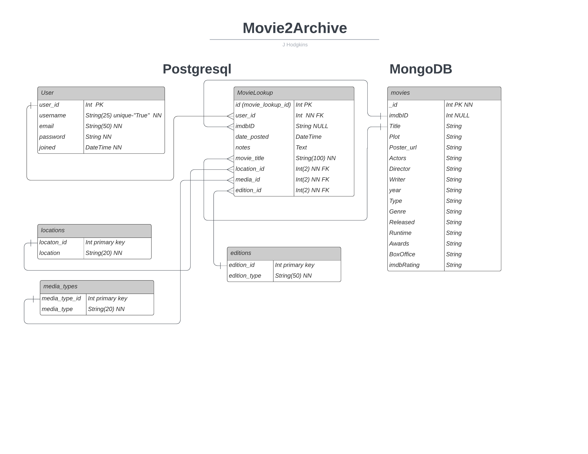

# Movie2Archive

Movie2Archive is a media management system application which organises into types and gather data from your movie collection and retrieves additional information about the movie for the user to consume.  
Movie2Archive helps users gather insight about their collection whilst giving them an easy and convenient way to keep their personal collection organised and up to date and potentially upcycle items they do not wish to keep.  

## Table of contents  
1. [Overview](#overview)
2. [Design brief](#design-brief)
3. [Research](#research)  
4. [Goals and Target audience](#goals-and-target-audience)  
    4.1 [Project goals](#project-goals)  
    4.2 [User goals](#user-goals)  
    4.3 [Site owners goals](#site-owners-goals)  
    4.4 [Target audience](#target-audience)  
5. [User experiance (UX)](#user-experiance-ux)  
    [User stories](#user-stories)  
    5.1 [First time user](#first-time-user)  
    5.2 [Returning user](#returning-user)  
    5.3 [Site owner](#site-owner)  
6. [Design](#design)  
    6.1 [Structure of pages](#structure-of-pages)  
    - [Nain content area](#main-content-area)  
    - [Footer section](#footer-section)   
    
    6.2 [Wireframes](#wireframes)  
    - [Homepage](#homepage)  
    - [Login page](#login-page)  
    - [Register page](#register-page)  
    - [Profile page](#profile-page)  
    - [Collections page](#collections-page)  
    - [Add movie page](#add-movie-page)  
    - [Edit movie page](#edit-movie-page)  
    
    6.3 [Colour palette](#colour-palette)  
    6.4 [Typography](#typography)  
    6.5 [Icons and imagery](#icons-and-imagery)  
    6.6 [Sitemap and Databases](#sitemap-and-databases)  
    6.7 [Features](#features)  
    - [Existing features](#existing-features)  
    - [Features to be implimented in future releases](#features-to-be-implimented-in-future-releases)  
7. [Testing](#testing)  

## Overview  
The Movie2Archive application is a database application which catalogues media collections into an easy-to-understand interface which can be use by all ages.  
The Movie2Archive application has been developed with a main goal to help organise, catalogue and provide an intrusive way to educate the end user about their or their families current media collection.  
The business purpose of Movie2Archive is to provide an easy and effective way of cataloguing and promote recycling aspects by easily allowing the user to see what they own and decide if duplicates or media is still needed or can be donated.  
The sites expected audience will be to anyone looking to archive a small to large collection of media, the sites audience would be any user who owns or has acquired a collection and is looking to evaluate its value or recycling potential.  
The application will provide to new users a reassurance and positive feeling by providing a simple intrusive interface which is clean and simple to use, the applications purpose is maintained throughout its interface and helps educate and promote curiously about the media they own through information provided back to the user after each media submission.  

## Design brief  
Plan, design and build a data driven application for users who have a personal media collection and wish to organise their collection or collections into a single structured manageable interface.  
The application will provide a safe and secure area for cataloguing their collections whilst allowing the user to organise their collections into locations and media types.  
The application will use external resources to inform the end user about interesting information relating to their media whilst allowing the user to edit and add their own information to create their own unique media catalogue.  

## Research  
Please view the [research](docs/research/RESEARCH.md) document for details of user research carried out through the planning phase for Movie2Archive.  

## Goals and Target audience  
### Project goals  
- The project will provide a platform where anyone interested in cataloguing and archiving their personal film media collection can done so with minimal effort.  
- The application will enable users to learn new details about their media collection through the application.  
- The project will help users organise their collection and decide what to keep or donate back to the community.  
- The users collection will be viewable and editable able using any browser.  

### User Goals
- Find information about what Movie2Archive is all about.  
- Find information about how to use Movie2Archive.  
- Easily register and catalogue their items.  
- Find information about a movie that is catalogued.   
- View their complete collection and their complete collection size.  

### Site owners goals  
- The Movie2Archive site owner would like to promote the pick-up and use approach of the application.  
- It is also important that users can see if duplicate copies are in their collection and promote recycling or donating.  
- Bild trust with its users so recommendations help grow the platform as a useful resource.  

### Target audience  
- The application will be able to be usable by all ages.  
- Those looking for an application to catalogue their movie collection.  
- Relatives or a user who has acquired a collection and wishing to understand what the collection contains.  
- Movie enthusiasts who want to discover information about a movie whilst also creating a catalogue of their items.  
- Charities or small establishments wising to keep a record of media held in stock.  

## User experiance (UX)  
During project planning, it was set out that the user interface should be easily understood to provide an overall good user experience and provide a positive feeling when navigating and interacting with the application.  
As the application is aimed at all ages, logical placement of buttons and understandable form fields will all be clearly tagged to ensure no barriers are present or experienced whilst using the application.  
Keyboard and screen reader navigation has also been considered and all elements can be reached using a keyboard to ensure the application is as accessible as possible to all users of the application.  

### User storues  
#### First time user  
As a first-time user, I want to understand what the applications purpose is so that I can decide if it meets my needs.  
As a first-time user, I want to be able to easily navigate to the registration page.  
As a first-time user, I want to find out how to add a movie to my collection.  
As a first-time user, I want to view my collection.   
As a first-time user, I want to find out more information about a movie I have added.  
As a first-time user, I want to find out how to remove a movie in case I make a mistake.  
As a first-time user, I want to know how to log out of Movie2Archive.  

#### Returning user  
- As a returning user, I want to be able to easily navigate to the login page.  
- As a returning user, I want to be able to edit a movie entry I have in my collection.  
- As a returning user, I want to be able to see how many movies are in my collection.  
- As a returning user, I want to be able to change my password.  
- As a returning user, I want to be able to move my collection to another room location.  
- As a returning user, I want to be able to delete my account.  

#### Site owner  
- As the site owner, I want visitors to find Movie2Archive approachable and know its purpose from the outset.  
- As the site owner, I want visitors to gain more information and learn new facts about the movies they own.  
- As the site owner, I want visitors to be able to easily add their movies.  
- As the site owner, I want the site visitors to be able to see what they own and see their collection by type to promote recycling.  

## Design  
Movie2Archive was designed to be clean, clear and easily understood by all audiences using the application, header and footer sections persist throughout the web application to ensure navigation is kept consistent to provide easy navigation and a pleasant user experience (UX).  
The application uses mainly solid colours which contrast each other, for example a darker grey against a orange giving the feeling of hard edges to reflect DVD, Blue Ray boxes and the boxy appearance of a media collection.  
As a person with a visual impairment, the website has been designed with screen magnification and screen readers in mind.  

### Structure of pages  
The website application uses a mobile first approach with the page having a maximum width of 1140px which centre aligns at higher resolutions these constraints were used to maintain the user’s focus, attention and aid sight lines.  

#### Header section  
The application follows a universal approach which comprises of a left aligned logo for Mobile through to Desktop.  
To the right is the applications main navigation, which is responsive, and full text links remain right aligned until tablet size and below where it will collapse to a right aligned Hamburger menu (toggle button).  
On devices tablet and below the user will be able to expand/collapse this menu using the menu toggle button to access all available menu items dependant on logged in status.  

#### Main content area  

#### Footer section  
The footer section was designed to be useful and useable; the footer is divided into two half page sections at tablet and above screen sizes.  
The left side will shows Movie2Archive social media links and the right side displays a copyright notice when on the landing page and when within the application.  

### Wireframes  
Wireframe designs show Mobile, Tablet and Desktop views of the main concept and parts of the application.  
The application follows best practice and was developed using a mobile first approach.  
#### Homepage  

Mobile

Tablet

Desktop

  

#### Login page  

Mobile

Tablet

Desktop

  
  
#### Register page  

Mobile

Tablet

Desktop

  

#### Profile page  

Mobile

Tablet

Desktop

  

#### Collections page  

Mobile

Tablet

Desktop

  

#### Add movie page  

Mobile

Tablet

Desktop

  

#### Edit movie page  

Mobile

Tablet

Desktop

  

### Colour palette  
   

- Davys Grey: #565555 was used as to represents the darkness of a theatre.  
- Yellow Orange: #FFB341and Red Crayola: #ED254E were used to represent the certification colours for PG and 18.  
- Silver Sand: #C4CAD0 was used to represent steel book covers of DVDs and Blue Rays and leans on a sci-fi feel.  
- Magnolia: #FCF7FF was used to represent the home, a widely used colour in many homes.  
- White: #FFFFFF and Black: 000000 were used for text and background colours as they are contrasting colours easily readable and have a feeling of sharp edges.  
- Black and white were primarily used for text, as they carry a high contrast level and are easily readable colours.  
I used a tool called Contrast Grid (colour palette) to determine the foreground and background combinations to ensure a minimum contrast ratio of 4.5:1 was maintained.  

I used a tool called Contrast Grid [view live colour palette](https://contrast-grid.eightshapes.com/?version=1.1.0&background-colors=&foreground-colors=%23ffffff%0D%0A%23000000%0D%0A%23565555%0D%0A%23FFB341%0D%0A%23FCF7FF%0D%0A%23C4CAD0%0D%0A%23ED254E&es-color-form__tile-size=regular&es-color-form__show-contrast=aaa&es-color-form__show-contrast=aa) to determine the foreground and background combinations to ensure a minimum contrast ratio of 4.5:1 was maintained.  
 

### Typography
Fonts used across the application were provided by Google fonts and were used in certain areas as to maintain readability.  
The two font families used were, Big Shoulders Display and Poppins, the fonts have a default fall-back of Sans-Serif.  
Heading elements of the application use: Big Shoulders Display, which gives a movie poster style to match the applications theme with Poppins being used across the remainder of the application elements, to ensure readability for users, the base font size was also set to 18px from the browser default 16px to aid magnification and all audience users.  

### Sitemap and databases  
Sitemap routes showng a logged in/out user routes.  
  
  
Database structure diagram outlining data structuure across the applicatons non-relational and relational databases.  
  

### Features  
This section looks at features which were implemented and those that with further research and knowledge will add to the existing set of features.  

#### Existing features  

#### Features to be implimented in future releases  

## Testing  
Please see [TESTING](docs/testing/TESTING.md) document for full details of the testng carried out whilst and after development of the Movie2Archive application.  