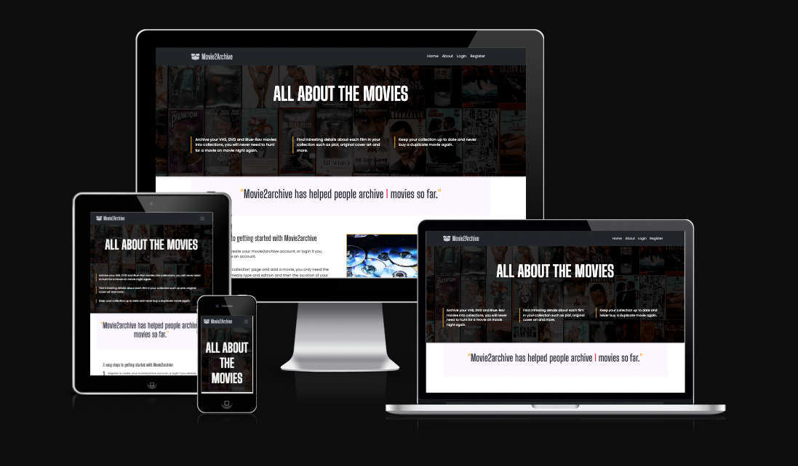

# Movie2Archive
  

Movie2Archive is a media management system application which organises into types and gather data from your movie collection and retrieves additional information about the movie for the user to consume.  
Movie2Archive helps users gather insight about their collection whilst giving them an easy and convenient way to keep their personal collection organised and up to date and potentially recycle items they do not wish to keep.  
[Live site preview link](https://movie2archive.herokuapp.com/)  

## Table of contents  
1. [Overview](#overview)
2. [Design brief](#design-brief)
3. [Research](#research)  
4. [Goals and Target audience](#goals-and-target-audience)  
    4.1 [Project goals](#project-goals)  
    4.2 [User goals](#user-goals)  
    4.3 [Site owners goals](#site-owners-goals)  
    4.4 [Target audience](#target-audience)  
5. [User experiance (UX)](#user-experiance-ux)  
    [User stories](#user-stories)  
    5.1 [First time user](#first-time-user)  
    5.2 [Returning user](#returning-user)  
    5.3 [Site owner](#site-owner)  
6. [Design](#design)  
    6.1 [Structure of pages](#structure-of-pages)  
    - [Header section](#header-section)  
    - [Main content area](#main-content-area)  
    - [Admin dashboard](#admin-dashboard)  
    - [Footer section](#footer-section)   
    
    6.2 [Wireframes](#wireframes)  
    - [Homepage](#homepage)  
    - [Login page](#login-page)  
    - [Register page](#register-page)  
    - [Profile page](#profile-page)  
    - [Collections page](#collections-page)  
    - [Add movie page](#add-movie-page)  
    - [Edit movie page](#edit-movie-page)  
    
    6.3 [Colour palette](#colour-palette)  
    6.4 [Typography](#typography)  
    6.5 [Icons and imagery](#icons-and-imagery)  
7. [Databases and sitemaps](#databases-and-sitemaps)  
    - [Api and databases](#api-and-databases)  
    - [Sitemap and routes](#sitemap-and-routes)  
8. [Features](#features)  
    8.1 [Existing features](#existing-features)  
    8.2[Features to be implimented in future releases](#features-to-be-implimented-in-future-releases)  
9. [Testing](#testing)  
10. [Technologies used](#technologies-used)  
    9.1 [Languages](#languages)  
    9.2 [Frameworks and libraries](#frameworks-and-libraries)  
    9.3 [Programs and online resources](#programs-and-online-resources)  

## Overview  
The Movie2Archive application is a database application which catalogues media collections into an easy-to-understand interface which can be use by all ages.  
The Movie2Archive application has been developed with a main goal to help organise, catalogue and provide an intrusive way to educate the end user about their or their families current media collection.  
The business purpose of Movie2Archive is to provide an easy and effective way of cataloguing and promote recycling aspects by easily allowing the user to see what they own and decide if duplicates or media is still needed or can be donated.  
The sites expected audience will be to anyone looking to archive a small to large collection of media, the sites audience would be any user who owns or has acquired a collection and is looking to evaluate its value or recycling potential.  
The application will provide to new users a reassurance and positive feeling by providing a simple intrusive interface which is clean and simple to use, the applications purpose is maintained throughout its interface and helps educate and promote curiously about the media they own through information provided back to the user after each media submission.  

## Design brief  
Plan, design and build a data driven application for users who have a personal media collection and wish to organise their collection or collections into a single structured manageable interface.  
The application will provide a safe and secure area for cataloguing their collections whilst allowing the user to organise their collections into locations and media types.  
The application will use external resources to inform the end user about interesting information relating to their media whilst allowing the user to edit and add their own information to create their own unique media catalogue.  

## Research  
Please view the [research](docs/research/RESEARCH.md) document for details of user research carried out through the planning phase for Movie2Archive.  

## Goals and Target audience  
### Project goals  
- The project will provide a platform where anyone interested in cataloguing and archiving their personal film media collection can done so with minimal effort.  
- The application will enable users to learn new details about their media collection through the application.  
- The project will help users organise their collection and decide what to keep or donate back to the community.  
- The users collection will be viewable and editable able using any browser.  

### User Goals
- Find information about what Movie2Archive is all about.  
- Find information about how to use Movie2Archive.  
- Easily register and catalogue their items.  
- Find information about a movie that is catalogued.   
- View their complete collection and their complete collection size.  

### Site owners goals  
- The Movie2Archive site owner would like to promote the pick-up and use approach of the application.  
- It is also important that users can see if duplicate copies are in their collection and promote recycling or donating.  
- Bild trust with its users so recommendations help grow the platform as a useful resource.  

### Target audience  
- The application will be able to be usable by all ages.  
- Those looking for an application to catalogue their movie collection.  
- Relatives or a user who has acquired a collection and wishing to understand what the collection contains.  
- Movie enthusiasts who want to discover information about a movie whilst also creating a catalogue of their items.  
- Charities or small establishments wising to keep a record of media held in stock.  

## User experiance (UX)  
During project planning, it was set out that the user interface should be easily understood to provide an overall good user experience and provide a positive feeling when navigating and interacting with the application.  
As the application is aimed at all ages, logical placement of buttons and understandable form fields will all be clearly tagged to ensure no barriers are present or experienced whilst using the application.  
Keyboard and screen reader navigation has also been considered and all elements can be reached using a keyboard to ensure the application is as accessible as possible to all users of the application.  

### User storues  
#### First time user  
As a first-time user, I want to understand what the applications purpose is so that I can decide if it meets my needs.  
As a first-time user, I want to be able to easily navigate to the registration page.  
As a first-time user, I want to find out how to add a movie to my collection.  
As a first-time user, I want to view my collection.   
As a first-time user, I want to find out more information about a movie I have added.  
As a first-time user, I want to find out how to remove a movie in case I make a mistake.  
As a first-time user, I want to know how to log out of Movie2Archive.  

#### Returning user  
- As a returning user, I want to be able to easily navigate to the login page.  
- As a returning user, I want to be able to edit a movie entry I have in my collection.  
- As a returning user, I want to be able to see how many movies are in my collection.  
- As a returning user, I want to be able to change my password.  
- As a returning user, I want to be able to move my collection to another room location.  
- As a returning user, I want to be able to delete my account.  

#### Site owner  
- As the site owner, I want visitors to find Movie2Archive approachable and know its purpose from the outset.  
- As the site owner, I want visitors to gain more information and learn new facts about the movies they own.  
- As the site owner, I want visitors to be able to easily add their movies.  
- As the site owner, I want the site visitors to be able to see what they own and see their collection by media type.  
- As a site owner, I want to encourage recycling to the applications users.  

## Design  
Movie2Archive was designed to be clean, clear and easily understood by all audiences using the application, header and footer sections persist throughout the web application to ensure navigation is kept consistent, easy to navigate and provides a pleasant user experience (UX) throughout.  

The application uses mainly solid colours which contrast each other well, for example a darker grey against orange gives the feeling of hard edges to reflect DVD, Blue Ray boxes and the boxy appearance of a media collection. .  
As a person with a visual impairment, the web application has been designed with screen magnification and screen readers in mind.  

### Structure of pages  
The website application uses a mobile first approach with the page having a maximum width of 1320px at retina resolutions or a 1140px for most standard displays which centre aligns at higher resolutions.  
These constraints were used to maintain the user’s focus, attention and aid with sight lines.  

#### Header section  
The application follows a universal approach which comprises of a left aligned logo for Mobile through to Desktop.  
To the right is the applications main navigation, which is responsive, and full text links remain right aligned until tablet size and below where it will collapse to a right aligned Hamburger menu (toggle button).  
On devices tablet and below the user will be able to expand/collapse this menu using the menu toggle button to access all available menu items dependant on their logged in status.  

#### Main content area  
The main content area is used to display content dynamically dependant on the user’s choice of action.  
When arriving at the homepage, this main area is used to introduce the application, a large above the fold title and three tag lines summarise the benefits of using Mobie2archive, below this are simple instructions on how to ue the application.  
This is followed by a complimentary section which encourages recycling through a trade for cash or free recycling service offered by the company Zapper.  

For the main sections of the application, the My collection and Profile areas, these follow a well-defined and purposeful approach also.

The My collection main area displays the added movies in a easy to understand list group, each list item contains the title, a snippet of the users note, and a view and edit link for easy editing and viewing of their archived movie title.  

The Profile section was developed to be the hub for the end user, the page contains again a large above the fold section which on the left gives a friendly welcome message and suggestions on what to do.
The right ide shows a large counter showing the total number of movies archived by the user.  
Below this is the main area which contains large tap/click target list group buttons which are sectioned into two parts, what would you like to do and update user details.  
These both contain a button with a text description summary of the buttons action, there are also extra information list items which are indicated by a ‘info’ tag.  

This approach was used to ensure that the user felt comfortable within the web application, encompassing content within the header allows the user to become familiar with the site navigation and always know how to navigate away or too their chosen area. This is true with the design of the profile area as a user will always know all common actions can be started at this location, no matter the device Movie2archive is being used on.  

#### Admin dashboard  
As a site owner or admin, a unique dashboard will be available in the main area of the profile page. This area allows a site owner or admin to see a summary of the whole application and to also add, edit or delete the sites categories, Media type, edition type and location area.

#### Footer section  
The footer section was designed to be useful and useable; the footer is divided into two half page sections at tablet and above screen sizes.  
The right side will show the Movie2archive social media icon links with the left side displaying a copyright notice.    

### Wireframes  
Wireframe designs show Mobile, Tablet and Desktop views of the main concept and parts of the application.  
The application follows best practice and was developed using a mobile first approach.  

#### Homepage  

Mobile

Tablet

Desktop

  

#### Login page  

Mobile

Tablet

Desktop

  
  
#### Register page  

Mobile

Tablet

Desktop

  

#### Profile page  

Mobile

Tablet

Desktop

  

#### Collections page  

Mobile

Tablet

Desktop

  

#### Add movie page  

Mobile

Tablet

Desktop

  

#### Edit movie page  

Mobile

Tablet

Desktop

  

### Colour palette  
   

- Davys Grey: #565555 was used as to represents the darkness of a theatre.  
- Yellow Orange: #FFB341and Red Crayola: #ED254E were used to represent the certification colours for PG and 18.  
- Silver Sand: #C4CAD0 was used to represent steel book covers of DVDs and Blue Rays and leans on a sci-fi feel.  
- Magnolia: #FCF7FF was used to represent the home, a widely used colour in many homes.  
- White: #FFFFFF and Black: 000000 were used for text and background colours as they are contrasting colours easily readable and have a feeling of sharp edges.   

I used a tool called Contrast Grid [view live colour palette](https://contrast-grid.eightshapes.com/?version=1.1.0&background-colors=&foreground-colors=%23ffffff%0D%0A%23000000%0D%0A%23565555%0D%0A%23FFB341%0D%0A%23FCF7FF%0D%0A%23C4CAD0%0D%0A%23ED254E&es-color-form__tile-size=regular&es-color-form__show-contrast=aaa&es-color-form__show-contrast=aa) to determine the foreground and background combinations to ensure a minimum contrast ratio of 4.5:1 was maintained throughout the application.  
 

### Typography
Fonts used across the application were provided by Google fonts and were used in certain areas as to maintain readability.  
The two font families used were, Big Shoulders Display and Poppins, the fonts have a default fall-back of Sans-Serif.  
Heading elements of the application use: Big Shoulders Display, which gives a movie poster style to match the applications theme with Poppins being used across the remainder of the application elements, to ensure good readability for all users.    

### Icons and Imagery  
All icons used within the web application were provided by Font Awesome free icon set with the image of a selection of dvd film covers provided by Tyson Moultrie and the image of a collection of bare discs provided by Cameron Bunney, both of these images were supplied by Unsplash.com.  
The icons used were selected to represent the section content or link that will be performed on the application.  
These icons can be scaled to high magnification levels and remain clear and sharp.  
The movie cover image was used as it sets the scene for the web applications overall theme, it also draws the eye to the main title which evolves the users understanding of what the application is about.  
The image of bare discs was used to represent clutter or chais with media, again bringing the users feeling to take action and Movie2archive is a solution to that problem, the image also aids the content section contents when explaining how easy it is to organise a collection in 3 easy steps.  
FontAwesome icon set:  

  

Unsplash images used within application:  
  

## Databases and sitemaps  
Database structure diagram outlining data structure across the applications relational and non-relational databases.  

  

The PostgreSQL database has been setup as a highly normalised database, which will provide a good structure to organise the users, media types and locations through the use of relational tables, this approach has provided the flexibility to incorporate other databases whilst eliminating redundancy and any inconsistent dependencies.  

Building on thr relational database, MongoDB a document based non-relational database has been built into the model to act as a standalone document store but also be relational through the structure within PostgreSQL, bringing together a relational but flexible database solution for the Movie2archive web application to use to deliver a structured but expandable solution for its users.  

### Api and databases  
MongoDB and PostgreSQL also work alongside a movie api provided by RapidApis which feeds in data through rules set up in the relational database to then populate both database to form the glue which provides extra information to the end user.  
The api follows rule when adding data and takes a transactional approach checking if entries are present in a database as to reduce redundancy and improve efficiency for the application.  
This image shows a high level overview of the api call and its intergration with the relational and non-relational database and how they are bought together.  
   

### Sitemap and routes  
Sitemap route images showing a logged in and logged out user routes. The first image is a concept image and the second is how Movie2archive appears to a user today.  

  

   
The light blue boxes represent available routes to an admin user.  

## Features  
This section looks at features which were implemented into the MVP (minimum viable product) and those that with further research technical knowledge alongside user feedback will be added to the existing set of features and be released in future feature updates.  

### Existing features  
- Responsive web application which reflows up to 500% zoom using browser zoom.  
- Responsive navigation menu bar with off canvas slide in over content.  
- Form validation with visual feedback given through on screen markers, surrounds including successful form submission flash messages.  
- CSRF (cross site request forgery) prevention, encryption on all forms throughout the application.  
- Api integration for providing additional information to a user’s movie entry.  
- Filterable collection display by media type.  
- Full CRUD functionality for a user with movie entries and user account settings.  
- Intergrated admin management dashboard for managing media types, location areas and media editions.  
- Simple logical layout.  
- Accessible on all devices with an internet connection.  
- Accessible to keyboard and assistive technologies.  

### Features to be implimented in future releases  
- Intergrate a service worker and local storage feature to store entries until a connection online is made.  
- Rating system so a user can rate the film and be sharable on  the main homepage.  
- UPC scanning of barcodes to help with entering precise title data.  
- Allow users to create their own unique locations.  
- Swap or marketplace to sell/trade unwanted media through their collection.  
- Third party affiliate scheme to offer an easy way to trade in and recycle.  

## Testing  
Please see the [TESTING](docs/testing/TESTING.md) document for a full breakdown of the testng carried out through development stages and after development of the Movie2Archive web application.  

## Technologies used  
A list of all technologies and software and online resources used to create the Movie2archive web application.  
### Languages  
-  [HTML](https://en.wikipedia.org/wiki/HTML5)  
-  [CSS](https://en.wikipedia.org/wiki/CSS)  
-  [JS](https://en.wikipedia.org/wiki/JavaScript)  
- [Python](https://en.wikipedia.org/wiki/Python_(programming_language))  
- [JinJa](https://en.wikipedia.org/wiki/Jinja_(template_engine))  

### Databases  
- [PostgreSQL](https://en.wikipedia.org/wiki/PostgreSQL)  
- [MongoDB Atlas](https://en.wikipedia.org/wiki/MongoDB)  

### Frameworks and libraries  
-  [Flask](https://flask.palletsprojects.com/en/2.2.x/)  
-  [Bootstrap version 5.2.0](https://getbootstrap.com/)  
-  [Font Awesome](https://fontawesome.com/), Icons used throughout the site.  
-  [Google fonts](https://fonts.google.com/), Big Shoulders Display and Poppins fonts were used across the application.  

### Programs and online resources  
-  [favicon.io](https://favicon.io) used to create the favicon.
-  [GitHub](https://github.io), was used to store committed files
-  [Git](https://git-scm.com/) and [Gitpod](https://gitpod.io/), used in conjunction through Gitpod to commit and push files to GitHub
-  [Photoshop 2022](https://adobe.com), used for editing of screenshots.  
-  [Figma](https://www.figma.com/), used to create the wireframe designs of the applicaion.
-  [Colour scheme](https://coolors.co/565555-ffb341-fcf7ff-c4cad0-ed254e), used to create a colour palette.  
-  [Lighthouse](https://developers.google.com/web/tools/lighthouse), used to test performance, accessibility, best practices, and SEO within the Chrome browser.
-  [Am I Responsive](http://ami.responsivedesign.is/), used for generating the main README image.  
-  [CSS Minifier](https://www.toptal.com/developers/cssminifier/), used to minify CSS.  
- [Flask/JinJa documentation](https://flask.palletsprojects.com/en/1.1.x/templating/)  Used to trouble shoot some templating issues with rendering for loops.  
